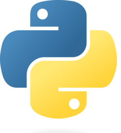

# Python Delicacies Training

A collection of Python notebooks to explore some of the language's core concepts and more *delicate* features. These interactive Jupyter Notebooks cover practical examples and exercises that should help deepen your Python knowledge through hands-on practice.

## Overview

### Python Exercises

Interactive coding challenges and games to practice fundamental Python concepts:

- **Control Flow**: Number guessing games demonstrating loops, conditionals, and user input handling
- **Data Structures**: Hangman and Capitals Quiz games showcasing lists, dictionaries, and string manipulation
- **Practical Exercises**: Real-world programming challenges including binary search implementation and calculator creation

### Python Intro

Foundation concepts and Python philosophy:

- **Learning Resources**: Curated list of official documentation and quality learning materials
- **Python 2 vs Python 3**: Important differences and migration considerations
- **Zen of Python**: Guiding principles for Python design
- **Basic Types**: Strings with f-string formatting, functions with variadic arguments, and numeric types

### Data Structures

Comprehensive coverage of Python's built-in data structures:

- **Lists**: Mutable sequences, list comprehensions, and advanced manipulation techniques
- **Iterators**: Lazy evaluation, generator expressions, and functional programming concepts
- **Tuples**: Immutable sequences, unpacking, and multiple return values
- **Sets**: Unique collections, set comprehensions, and mathematical operations
- **Dictionaries**: Key-value mappings, dict comprehensions, and dynamic views
- **Slicing**: Advanced indexing techniques for sequence manipulation

### Classes, Types, and Decorators

Object-oriented programming and advanced Python features:

- **Classes**: Object construction, inheritance, and multiple inheritance patterns
- **Dunder Methods**: Magic methods for operator overloading and built-in function integration
- **Type Hints**: Static type annotations for better code documentation and tooling support
- **Decorators**: Function and class decorators, including custom decorator creation and decorator factories

### Files and Asynchronous I/O

File operations and concurrent programming:

- **File Operations**: Reading and writing text and binary files with proper resource management
- **Context Managers**: Proper resource handling with the `with` statement
- **Asynchronous Programming**: `async`/`await` syntax, coroutines, and concurrent execution
- **Async I/O Patterns**: TaskGroups, async generators, background tasks, and async iteration

## Prerequisites

- Basic programming knowledge
- Python 3.8+ installed
- Jupyter Notebook environment
